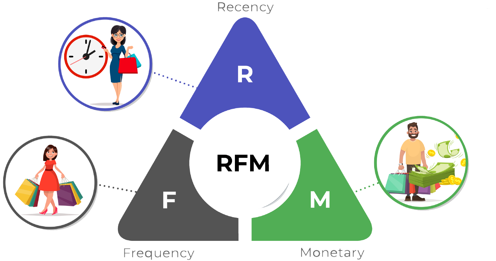

# RFMClusify

 <!-- replace "link_to_logo_image" with the actual URL or file path of the logo image -->

## Files

1. `RFMClustering.ipynb`
   - This notebook contains the code for performing RFM clustering on customer data.
   - It uses the RFM (Recency, Frequency, Monetary) method to calculate customer scores.
   - The clustering algorithm is applied to identify different customer segments.

2. `RFMClusteringDBSCAN.ipynb`
   - This notebook explores the use of DBSCAN (Density-Based Spatial Clustering of Applications with Noise) algorithm for RFM clustering.
   - DBSCAN is a density-based clustering method that can discover clusters of arbitrary shapes.
   - It can be an alternative to traditional clustering algorithms like k-means.

3. `RFMClusteringElbow.ipynb`
   - This notebook demonstrates the use of the elbow method to determine the optimal number of clusters in RFM clustering.
   - The elbow method helps find the appropriate number of clusters by analyzing the within-cluster sum of squares (WCSS) for different cluster counts.

Feel free to explore these notebooks to understand the implementation details of RFM clustering and its variations.

## How to Use

1. Clone the repository: `git clone https://github.com/your-username/RFMClusify.git`
2. Open the desired notebook (e.g., RFMClustering.ipynb) in a Jupyter Notebook environment.
3. Install the necessary dependencies if required.
4. Follow the instructions in the notebook to run the code and analyze the results.

Please note that this repository is focused on using the RFM method for customer segmentation and clustering. It provides a starting point for analyzing customer behavior and optimizing marketing strategies based on the RFM framework.

If you have any questions or need further assistance, feel free to reach out.
